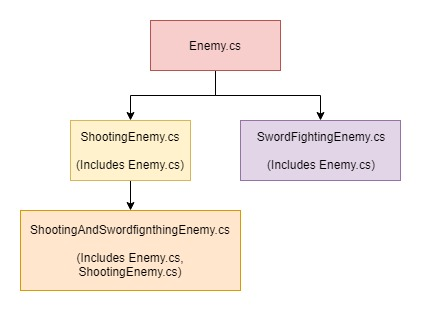

<figure>
	<blockquote>
		
"In Unity, GameObjects are constructed through composition rather than classical inheritance."

	</blockquote>
</figure>

## Inheritace
**Inheritance** allows classes to take on properties of other existing classes. This is helpful in preventing code repetition and general organization. Traditionally in game dev, the enemy class is an extension of a base class (NPC or something). The different varieties of enemies are all then extended from the enemy superclass.

To create a swordsman enemy you would just need the `SwordFightingEnemy` class added to the GameObject. All the needed behaviors (AI, health, etc.) would already be inherited from the superclasses.

## Composition
Unity uses a different method called **Composition** to add functionality to GameObjects. For composition, each piece of functionality is split up into classes which can be modularly added of a GameObject.

For example, let's use the enemies from the inheritance example, ones that shoot projectiles and ones that use swords.

Three different types of enemies are created from only three different components (Enemy, FireProjectile, and SwordFighting) as compared to the inheritance method that uses four components ( Enemy, ShootingEnemy, ShootingAndSwordfightingEnemy, and SwordFightingEnemy).

This modular approach makes it really easy to share functionality between objects and quickly generate different variations. For more information about the subject, check out the [Wiki](https://en.wikipedia.org/wiki/Composition_over_inheritance).

-CL