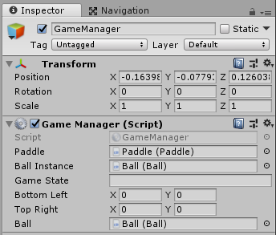
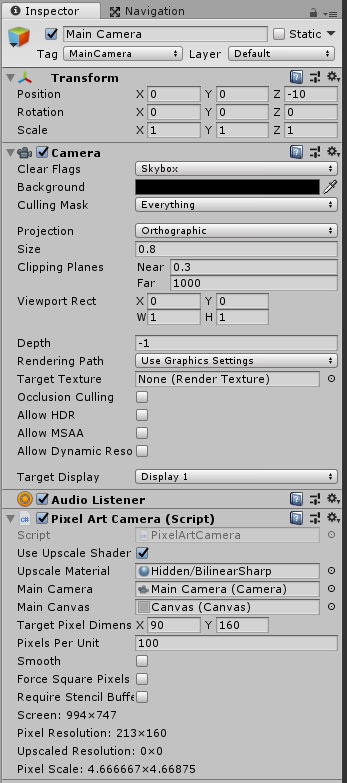
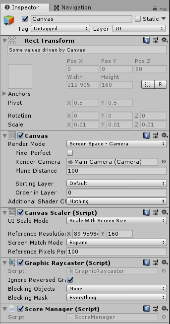
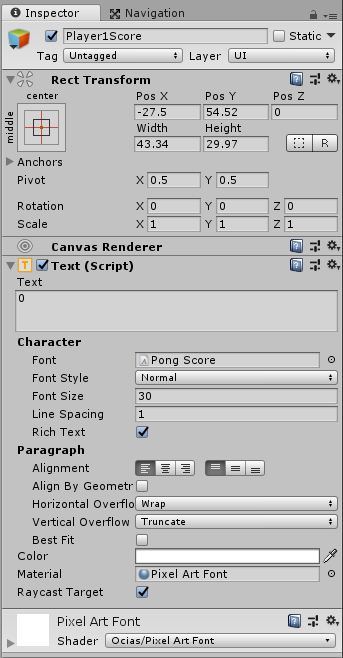
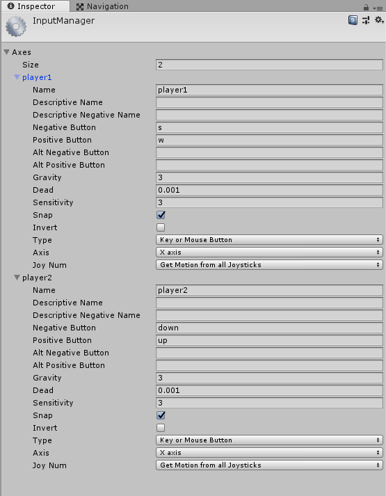
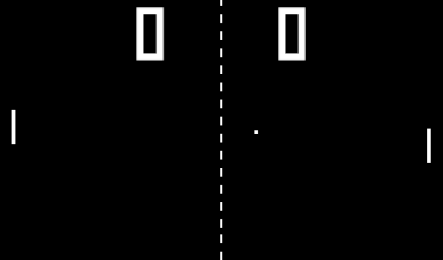

# Classic Pong

As part of my journey to become a better game developer and learn more about Unity 2018, I've decided to recreate a few classic games from scratch. Pong seemed like a good place to start. My goals for this exercise are to:

- Create an accurate representation of the original Pong
- Pixel perfect rendering
- Learn Unity 2018

The final results for the project can be found here: [Github - Classic Pong](https://github.com/Lumlicious/Unity-Classic-Pong)

## Lets get started!


(From Wikipedia)

To begin this project we'll need a few things:

### Font

[Pong Score Font](https://fontstruct.com/fontstructions/show/1158273/pong_score) - 
This authentic looking pong font only contains numbers so It'll be used for the score.

### Sprites

I used the [piskelapp](https://www.piskelapp.com/) website to create the pixel art and export them as PNG files.

- Ball - 2 x 2 px
- Paddle - 2 x 20 px
- Dashes - two 1 x 5 px on same sprite. (I just repeated this vertically)

### Pixel Art Camera/Sprite Shader

To achieve pixel perfect graphics at the correct resolution I used the free [Pixel Art Camera](https://github.com/AlexanderOcias/UnityPixelArtCamera). This solution uses the camera to render at the desired resolution and conforms the sprites to a pixel grid. There are other solutions out there, but this one works great and is open source.

Now let's get to some code!

## Game Manager

We first need a place to store the current game state and control the game loop. Let's start by creating a new script called `GameManager.cs`.

```csharp
using System.Collections;
using System.Collections.Generic;
using UnityEngine;

public class GameManager : MonoBehaviour {
	void Start() {}
	void Update() {}
}
```

We first need to make sure this class is present throughout all scenes. The magic way to do this is using [DontDestroyOnLoad()](https://docs.unity3d.com/ScriptReference/Object.DontDestroyOnLoad.html), which persists an instance of a GameObject when loading a new scene, preventing it from being destroyed. Really useful.

```csharp
public static GameManager instance = null;

void Start() {
	if (instance == null) {
		instance = this;
	}
	else if (instance != this) {
		Destroy(gameObject);
	}

	DontDestroyOnLoad(gameObject);
}
```

Next, let's add the paddle and ball prefab references to the class and add them to the screen. We can use the `[SerializeField]` to drag and drop the prefabs onto the class from the editor.

```csharp
...
public Vector2 bottomLeft;
public Vector2 topRight;

private Vector2 player1StartPosition;
private Vector2 player2StartPosition;

void Start() {

	...

	// Get the size of the current view so we can position relative to the screen
	bottomLeft = Camera.main.ScreenToWorldPoint(new Vector2(0, 0));
	topRight = Camera.main.ScreenToWorldPoint(new Vector2(Screen.width, Screen.height));

	// Get start positions for player 1 and 2 paddles
	player1StartPosition = new Vector2(bottomLeft.x + xOffset, 0);
	player2StartPosition = new Vector2(topRight.x - xOffset, 0);

	// Create paddles for player 1 and 2
	Paddle player1 = Instantiate(paddle, player1StartPosition, Quaternion.identity) as Paddle;
	Paddle player2 = Instantiate(paddle, player2StartPosition, Quaternion.identity ) as Paddle;

	// Set paddle as player
	player1.Init("player1");
	player2.Init("player2");

}
```

Now that we have the have the paddle positions set, let's add the main game loop. To get the game started, the ball will be served when the user hits the enter/return key.

```csharp
public string gameState;

Start() {
	...
	// Set the initial game state
	gameState = "waitingForServe";
	...
}

void Update() {
	// If the user presses the return/enter key serve the ball
	if( Input.GetKeyDown("return") && gameState == "waitingForServe") {
		serve();
	}
}

void serve() {
	// Create ball
	ball = Instantiate(ballInstance, new Vector2(0,0), Quaternion.identity);

	// Update game state
	gameState = "gameInPlay";
}
```

## The Ball

The ball needs to have basic physics behavior, but not a super accurate representation. It basically needs to move forward and rebound off the top and bottom of the screen as well as the paddles. When a collision is detected we can easily reverse the direction by reversing the vector by multiplying by -1 (-V). Velocity should remain constant.

### Script

We first want the ball to be initialized from the middle of the screen with an initial speed in a random direction. The speed variable is serialized so we can control the speed from the editor as we may need to fine tune it later.

Create a new script named `Ball.cs`.

```csharp
using System.Collections;
using System.Collections.Generic;
using UnityEngine;

public class Ball : MonoBehaviour {

	[SerializeField]
	float speed;

	Vector2 direction;

	void Start () {
		// Create random vector. Use range to prevent serving at steep angle.
		direction = new Vector2(Random.Range(-0.5f, 0.5f), Random.Range(-0.5f, 0.5f));

		// Normalize vector so magnitude is 1, the multiply by speed
		direction = direction.normalized * speed;
	}
}
```

The ball will move itself forward based on the vector, so we need to do this in the update:

```csharp
void Update () {
	transform.Translate (direction * speed * Time.deltaTime);
}
```

When the ball hits the top or the bottom of the screen it is deflected back. Also, if the ball hits the left or right of the screen the ball is destroyed.

```csharp
void Update () {
	// Move the ball in the direction of the vector
	transform.Translate (direction * speed * Time.deltaTime);

	// Bounce ball off top or bottom of the screen
	if (transform.position.y < GameManager.instance.bottomLeft.y && direction.y < 0) {
		direction.y = -direction.y;
	}
	if (transform.position.y > GameManager.instance.topRight.y && direction.y > 0 ) {
		direction.y = -direction.y;
	}

	// SCORE!!! Remove ball.
	if (transform.position.x < GameManager.instance.bottomLeft.x) {
		Object.Destroy(this.gameObject);
	}
	if ( transform.position.x > GameManager.instance.topRight.x ) {
		Object.Destroy(this.gameObject);
	}
}
```

To detect if the ball has collided with a paddle we need to use the `OnTriggerEnter2D` lifecycle event to get the object collided with. If the tag is a paddle, get the player name and bounce back in the correct direction.

```csharp
void OnTriggerEnter2D(Collider2D other) {
	if (other.tag == "paddle") {
		string player = other.GetComponent<Paddle>().input;
		if (player == "player1" && direction.x < 0) {
			direction.x = -direction.x;
		}
		if (player == "player2" && direction.x > 0) {
			direction.x = -direction.x;
		}
	}
}
```

### Prefab

Create a new Empty GameObject on the stage and add a Sprite Renderer (`add component --> rendering --> sprite renderer` ) to it. Drag the ball sprite image to the to the `Sprite` field. For the pixel perfect to work, import the `piskelapp` files and drag the `Pixel Art` material to the `Material` slot.

To add physics to the ball, we need to add a `2D box collider` along with a `2D Rigidbody`. This will allow the ball to collide with the paddles.

The GameObjects we created are not Prefabs yet, so we need to drag them from the stage into a prefabs project folder.

## The Paddle

Movement for the paddle is controlled by the user and should be restricted to always be visible on the screen. Also, the ball already reacts to the collision, so no extra logic is needed.

### Script

We first need to set up some initial variables. The speed of the paddle needs to be tweaked to get the right feel, so we can serialize it. We also need to capture the input method and the user name. 

Create a new script called: `Paddle.cs`.

```csharp
using System.Collections;
using System.Collections.Generic;
using UnityEngine;

public class Paddle : MonoBehaviour {

	[SerializeField]
	float speed;

	public string input;

	private float height;

	void Start() {
		// Get hight of the collider.
		height = GetComponent<Collider2D>().bounds.size.y;
	}

	// Constructor
	public void Init(string player) {
		// Set paddle to player
		input = player;

		// Change paddle name to player name
		transform.name = player;
	}
```

On each frame we need to check for user input and move the paddle accordingly along the y-axis. The paddle also needs to stay within the screen so we need to"clamp" it's position.

```csharp
void Update () {

	// Get velocity based on input
	float velocity = Input.GetAxis(input) * Time.deltaTime * speed;

	// Clamp movement to screen space
	if ((transform.position.y < GameManager.instance.bottomLeft.y + height / 2 && velocity < 0) ||
		(transform.position.y > GameManager.instance.topRight.y - height / 2 && velocity > 0)) {
		velocity = 0;
	}

	// Move paddle
	transform.Translate(velocity * Vector2.up);
}
```

### Prefab

Follow the same steps for the ball.

## Scene Setup

Now that we have some things to stick on the page, let's start getting the scene setup. I usually start with a new scene: `File --> New Scene`.

### Game Manager

If you haven't already, add a new GameObject to the scene and attach the GameManager.cs script as a component. Drag the Ball and paddle prefabs to the script arguments in the inspector.



### Camera

To set the camera up we need to make few changes from the default:

- Name: MainCamera
- Position: (0, 0, -10)
- Projection: Orthographic
- Size 0.8
- Depth: -1
- Uncheck Occlusion Culling, Allow HDR, and Dynamic Resolution

Now we need to add the imported `PixelArtCamera.cs` script to the camera to render out the pixel perfect shaders on our sprites.




### UI (Canvas)

To display the score we need to create a UI layer where the text can live. Right click in the hierarchy window and create a new canvas.

- Canvas
    - Render Mode: Screen Space - Camera 
    - Render Camera: Drag MainCamera to input
- Canvas Scaler: 
    - UI Scale Mode: Scale with Screen Size 
    - Reference resolution: 90 x 160 - Screen Match Mode: Expand



### Score Boxes

For the score boxes I just used the basic unity Text component by right-clicking the hierarchy window and selecting `UI --> Text`. **TextMeshPro** is way better, but since we're using the Pixel Art Camera shaders to handle the scaling, this should be fine. 

Create two of these. Name one `Player1Score` and the other `Player2Score`. Use the `Pong Score` font and drag the `PixelArtFont` material to the Material input.



### Dashes

For the dashes we can just manually place them on the screen in the center of the stage. Feel free to use some other clever programmatic method.

### Assign Inputs

Go to `Edit --> Project Settings --> Input` to assign the input keys for the different players. Player one will use the `s` and `w` keys and player two will use the `up` and `down` arrows.



### Score Manager

Let's first create a simple class called `ScoreManager.cs` which will live in the main canvas.

```csharp
using System.Collections;
using System.Collections.Generic;
using UnityEngine;
using UnityEngine.UI;

public class ScoreManager : MonoBehaviour {

	// Initialize score to 0
	public static int player1Score = 0;
	public static int player2Score = 0;

	private Text player1Scorebox;
	private Text player2Scorebox;

	void Start () {
		// When starting, get the text components in the canvas
		player1Scorebox = transform.Find("Player1Score").GetComponent<Text>();
		player2Scorebox = transform.Find("Player2Score").GetComponent<Text>();
	}

	void Update () {
		// Display current score in the text components
		player1Scorebox.text = player1Score.ToString();
		player2Scorebox.text = player2Score.ToString();
	}
}
```

Add this script to the Canvas.

### End Round/Game

When the ball exits the screen we first need to increment the winner's score. Next, we need to check if a player's score is more than the maximum. If there's a winner we need to trigger the endgame. 

In the `GameManager.cs` file we need to add these functions:

```csharp
public void endRound(string winner) {
	// Update game state
	gameState = "waitingForServe";

	// Update score
	if (winner == "player1") {
		ScoreManager.player1Score++;
	} else if (winner == "player2") {
		ScoreManager.player2Score++;
	}

	// Check if any players are winners
	if (ScoreManager.player1Score == 12 || ScoreManager.player2Score == 12) {
		gameOver();
	}
}

public void gameOver() {
    // Reset the scores to 0
	ScoreManager.player1Score = ScoreManager.player1Score = 0;
	ScoreManager.player2Score = ScoreManager.player2Score = 0;
}
```

Next we need to emit the event from `Ball.cs` to indicate that the ball has left the screen. 

In the `Update()` method for `Ball.cs`:

```csharp
	void Update () {
		transform.Translate (direction * speed * Time.deltaTime);

		if (transform.position.y < GameManager.instance.bottomLeft.y && direction.y < 0) {
			direction.y = -direction.y;
		}
		if (transform.position.y > GameManager.instance.topRight.y && direction.y > 0 ) {
			direction.y = -direction.y;
		}

		if (transform.position.x < GameManager.instance.bottomLeft.x) {
			Object.Destroy(this.gameObject);
			// End Round if Player 2 wins
			GameManager.instance.endRound("player2");
		}
		if ( transform.position.x > GameManager.instance.topRight.x ) {
			Object.Destroy(this.gameObject);
			// End Round if Player 2 wins
			GameManager.instance.endRound("player1");
		}
	}
```

## Conclusion



Hopefully you should be able to hit play and start Pong-ing away! Try tweaking the settings for the ball and paddle speeds to find a perfect balance.

 In case I missed anything the full project can be found on my [Github - Classic Pong](https://github.com/Lumlicious/Unity-Classic-Pong). If you have any questions or updates, feel free to fork and create a pull request.

Thanks,
CL
